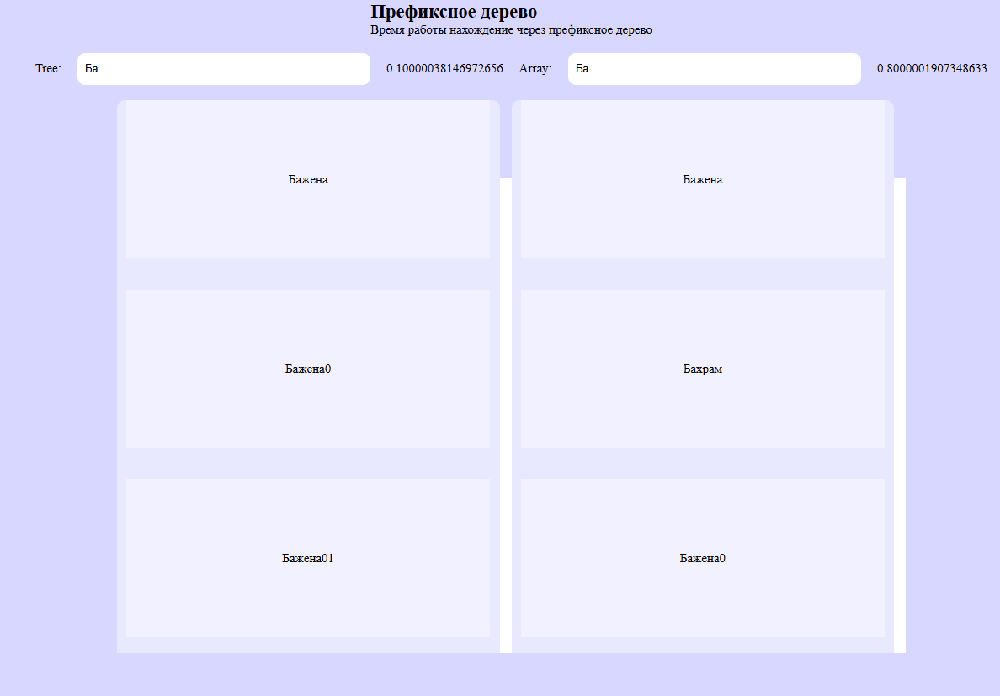

# Префиксное дерево
При большом колличестве элементов префиксное дерево работает намного быстрее чем обычный линейный перебор массива. При малом размере массива преминение префиксного дерева становиться не оправданным, из -за создания самого префиксного дерева и из-за увеличения сложности кода

